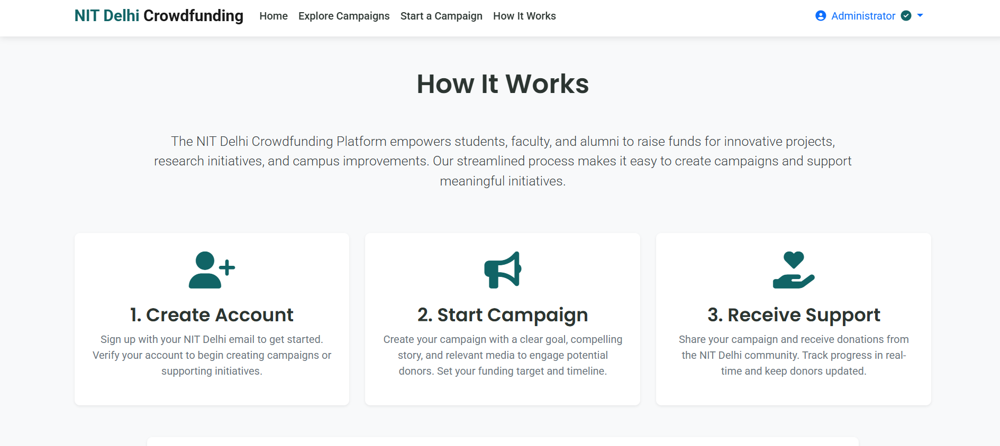

<h1 align="center">
<strong><em>NIT Delhi Crowdfund Hub</em></strong>
</h1>

A PHP-based crowdfunding platform for students, faculty, and alumni of NIT Delhi to raise funds for innovative projects and campus initiatives.

## Organized by:
- **Campaign Categories** (Research, Events, Scholarships, etc.)
- **Funding Goals** (₹5,000 - ₹10,00,000+)
- **Campaign Duration** (7-90 days)

## Users can:
- Create and manage fundraising campaigns
- Browse and support active campaigns
- Track donation history
- Admins can verify campaigns and manage users

## Tech Stack

- PHP
- MySQL
- HTML5/CSS3/JavaScript
- XAMPP / Apache

## Screenshots

### 🔹 Homepage

### 🔹 Homepage

### 🔹 Explore Campaigns

### 🔹 Login

### 🔹 Admin Dashboard

### 🔹 Create campaign 

### 🔹 Create campaign 

### 🔹 How It Works

## Database Overview

### 🔹 users Table
Stores user registration and verification details  

### 🔹 campaigns Table
Manages all crowdfunding campaigns  

### 🔹 donations Table
Tracks all donation transactions  

## 🙋 Author

- ***Souvik Das***
- B.Tech CSE, NIT Delhi
- [LinkedIn](https://linkedin.com/in/souvik-das-234ab9338/)

